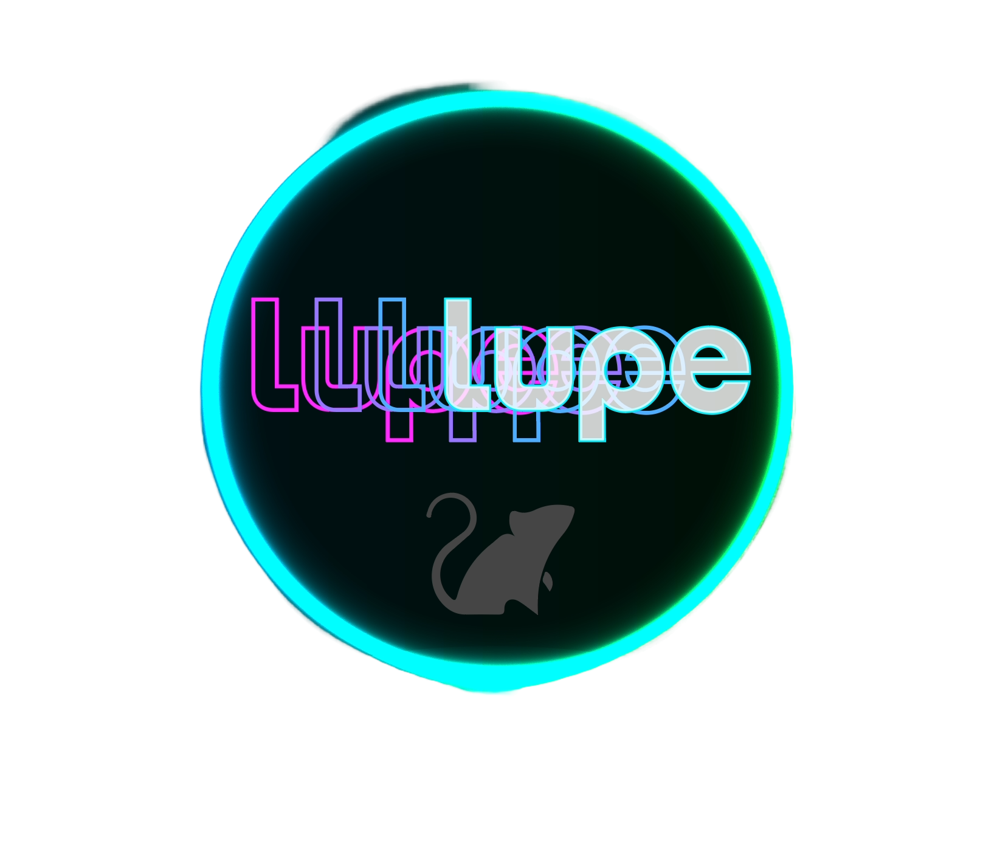

# LUPE 2.0 App

> 🔬 **Looking for the full analysis pipeline in Jupyter Notebooks?**  
Head over to the [LUPE 2.0 Analysis Package](https://github.com/justin05423/LUPE-2.0-AnalysisPackage). That repository provides the core analysis pipeline, reproducible Jupyter notebooks, and scripts to extend LUPE for advanced users who want direct control over the workflow.

<p align="center">

</p>

<p align="center">
Introducing LUPE 2.0 APP, the innovative analysis pipeline predicting pain behavior in mice.  
With our platform, you can input pose and classify mice behavior inside the LUPE Box.  
With in-depth analysis and interactive visuals, as well as downloadable CSVs for easy integration into your existing workflow.
</p>

<p align="center">
Try LUPE today and unlock a new level of insights into animal behavior!
</p>

## 📄 Associated Publication

LUPE is described and validated in our recent peer-reviewed publication in *Nature*:

> **Oswell, Rogers, James et al.**  
> *Mimicking opioid analgesia in cortical pain circuits*  
> **Nature (2025)**  
> 🔗 https://www.nature.com/articles/s41586-025-09908-w

If you use LUPE in your research, please cite this work.

## Table of Contents
- [System Requirements](#system-requirements)
- [Local Installation & App Start Guide](#local-installation--app-start-guide)
  - [One-Click App Launch (Recommended)](#-one-click-app-launch-recommended)
- [Updating App](#updating-lupe-app)
- [App Guide](#app-guide)
- [Physical System Build](#physical-system-build)
- [Contacting](#contacting)


---

# System Requirements

The LUPE-2.0 App requires only a standard computer with enough RAM to support Streamlit-based data analysis and interactive visualizations.

LUPE uses:  
- [DeepLabCut](https://github.com/DeepLabCut)<sup>1,2</sup> for pose estimation  
- [A-SOiD](https://github.com/YttriLab/A-SOID)<sup>3</sup> for behavior classification  

These models are pre-trained and integrated into the app.  
👉 **Be sure to follow [Step 2 in the Local Installation Guide]** to properly obtain and place the LUPE-A-SOiD model before running the app.

> 💡 **Recommended Setup**  
> We recommend installing all dependencies using [Anaconda](https://www.anaconda.com/products/distribution), a package and environment manager that simplifies Python project setup and avoids conflicts.

### OS Requirements

- ✅ **Windows** – fully supported  
- ✅ **macOS** – fully supported  
- ⚠️ **Linux** – supported with manual installation of certain packages

### Python Dependencies

- Please refer to the `requirements.txt` file for all necessary Python libraries.

---

# Local Installation & App Start Guide

### To install “LUPE-2.0-App” on your own computer, follow these steps:

1. **Clone or Download the Repository**  
   A repository is just the project’s folder on GitHub. You need a copy of that folder on your computer.
   - **Clone** uses Git to make a local copy that stays linked to GitHub, so you can get updates later with `git pull`.
   - **OR** grab a one-time ZIP of the files by clicking **[HERE](https://github.com/justin05423/LUPE-2.0-App/archive/refs/heads/main.zip)**. It’s not linked, so you won’t get updates unless you download again.

   Open your terminal / command prompt and run:
   ```bash
   git clone https://github.com/justin05423/LUPE-2.0-App.git
   ```
   Then set the directory of your terminal/command prompt to this folder:
   ```bash
   cd LUPE-2.0-App
   ```

3. **Download the LUPE 2.0 A-SOiD Model** (If the model is **not already present** in the `Model/` folder) 
   - Download from 👉 [HERE](https://upenn.box.com/s/9rfslrvcc7m6fji8bmgktnegghyu88b0)
   - Move the contents into the `Model/` folder inside `LUPE-2.0-App` 

     > **Note**: For analyzing and retrieving pose estimation for LUPE video data, find the LUPE 2.0 DLC Model [HERE](https://upenn.box.com/s/av3i14c64rj6zls9lz6pda0it5b5q7f3).

4. **Create the Conda Environment**
   - Make sure [Anaconda](https://www.anaconda.com/products/distribution) is installed.
   - Open your Anaconda terminal. Run the following code to make the LUPE2App Environment:

     For **macOS / Linux**:
      ```bash
      conda env create -f LUPE2_App.yaml
      ```
      
     For **Windows**:
      ```bash
      conda env create -f LUPE2_App_Win.yaml
      ```

5. **Launch the LUPE App 🚀**
   ### Overview
   LUPE-2.0-App can be launched in **two ways**:

   i) **One-Click Launch (Recommended)** – double-click a file to start the app automatically  

   ii) **Manual Launch (Advanced)** – run Streamlit from the command line
      
   | ⚡ One-Click App Launch (Recommended) | 🛠 Manual App Launch (Advanced / Debugging) |
   |-------------------------------------|--------------------------------------------|
   | **How to start**<br>Double-click a launcher file | **How to start**<br>Run Streamlit from the terminal |
   | **Command needed**<br>None | **Command needed**<br>`streamlit run lupe_analysis.py` |
   | **Best for**<br>Most users, quick startup, demos | **Best for**<br>Debugging, development, advanced use |
   | **Environment handling**<br>Automatically activates `LUPE2APP` | **Environment handling**<br>User must activate `LUPE2APP` |
   | **Browser behavior**<br>Opens automatically | **Browser behavior**<br>Opens automatically |
   | **Where it runs**<br>Local machine (`localhost`) | **Where it runs**<br>Local machine (`localhost`) |
   
   ### ⚡ One-Click App Launch (Recommended)  
      Once the environment is installed, LUPE can be launched by **double-clicking a file** — no terminal commands needed.
      
      | Operating System | Launcher File |
      |------------------|---------------|
      | macOS | `RunOS_LUPE.command` |
      | Windows | `RunWin_LUPE.bat` |
      | Linux | `RunLinux_LUPE.sh` |
      
   ### 🛠 Manual App Launch (Advanced / Debugging)
      If you prefer launching LUPE manually from the terminal...
      1. Activate the LUPE2APP Environment.
         In your Anaconda terminal/command prompt, ensure you are in the `LUPE-2.0-App` directory, then run:
         ```bash
         conda activate LUPE2APP
         ```
      2. Run the App 😎 Streamlit will print the local URL and open the app in your browser automatically.
         ```bash
         streamlit run lupe_analysis.py
         ```
   
   ### 🧠 Troubleshooting Tips
      - If the app does not open automatically, check the terminal output for the local URL
      - If another Streamlit app is already running, Streamlit may use a different port
      - Always ensure `LUPE2APP` is activated before launching

---

# Updating LUPE App

To update your local copy of LUPE-2.0-App to the latest version, follow these steps:

1. Open your terminal or command prompt and navigate to the `LUPE-2.0-App` directory:
```bash
   cd LUPE-2.0-App
```
2. Pull the latest changes from the GitHub repository:
```bash
   git pull --ff-only origin main
```
   This keeps your local files that the app modifies (`model/model.pkl` and `utils/meta.py`) intact. Your processed data in `LUPEAPP_processed_dataset/` is never touched by updates.

   If git refuses with a message like `error: Your local changes to the following files would be overwritten`, an update changed one of those files. Back them up, force the update, then restore the model:
```bash
   cp model/model.pkl ../model_backup.pkl
   cp utils/meta.py ../meta_backup.py
   git fetch origin --prune
   git reset --hard origin/main
   cp ../model_backup.pkl model/model.pkl
```
   Then re-run preprocessing step 1 for each of your projects so their groups and conditions are registered again (or copy the `groups_<project>` and `conditions_<project>` lines from `../meta_backup.py` back into `utils/meta.py`).
3. If the release notes in `CHANGELOG.md` mention changes to the Conda environment files (`LUPE2_App.yaml` or `LUPE2_App_Win.yaml`), update your environment:
```bash
   conda env update -f LUPE2_App.yaml --prune
```
   or for Windows:
```bash
   conda env update -f LUPE2_App_Win.yaml --prune
```
4. Restart your environment and run the app as usual.

> **Check after updating:** `model/model.pkl` should be much larger than a few hundred bytes. If it is tiny, it has been replaced by a placeholder; re-download the model from the link in the installation steps above and replace the file.

---

# App Guide

For a detailed walkthrough on using the LUPE 2.0 App, check out the [App Walkthrough](https://github.com/justin05423/LUPE-2.0-App/wiki/LUPE-2.0-App-Walkthrough--%F0%9F%9A%80).

---

# Physical System Build

For an overview on building the LUPE 2.0 System, check out the [Build](https://github.com/justin05423/LUPE-2.0-App/wiki/LUPE-2.0-Build-%F0%9F%9B%A0%EF%B8%8F-%F0%9F%A7%B0).

---

# Contacting

#### Project Funding  
- Collaboration between [Corder Lab](https://corderlab.com/) at University of Pennsylvania and [Yttri Lab](https://labs.bio.cmu.edu/yttri/) from Carnegie Mellon.

#### Contributors  
- Justin James [(Corder Lab)](https://corderlab.com/) actively develops and maintains this repository/cloud resource.
- Other contributors include: Alexander Hsu [(Yttri Lab)](https://labs.bio.cmu.edu/yttri/).

---

# License

LUPE is released under a Clear BSD License and is intended for research/academic use only.

# References

1. [Mathis A, Mamidanna P, Cury KM, Abe T, Murthy VN, Mathis MW, Bethge M. DeepLabCut: markerless pose estimation of user-defined body parts with deep learning. Nat Neurosci. 2018 Sep;21(9):1281-1289. doi: 10.1038/s41593-018-0209-y. Epub 2018 Aug 20. PubMed PMID: 30127430.](https://www.nature.com/articles/s41593-018-0209-y)  
2. [Nath T, Mathis A, Chen AC, Patel A, Bethge M, Mathis MW. Using DeepLabCut for 3D markerless pose estimation across species and behaviors. Nat Protoc. 2019 Jul;14(7):2152-2176. doi: 10.1038/s41596-019-0176-0. Epub 2019 Jun 21. PubMed PMID: 31227823.](https://doi.org/10.1038/s41596-019-0176-0)  
3. [Tillmann JF, Hsu AI, Schwarz MK, Yttri EA. A-SOiD, an active-learning platform for expert-guided, data-efficient discovery of behavior. Nat Methods. 2024 Apr;21(4):703-711. doi: 10.1038/s41592-024-02200-1. Epub 2024 Feb 21. PMID: 38383746.](https://www.nature.com/articles/s41592-024-02200-1)
